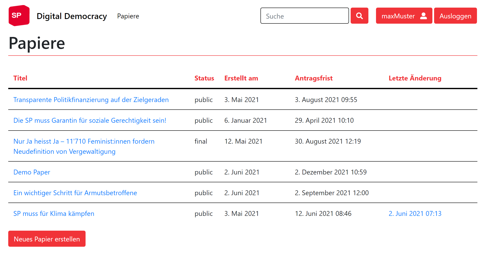

# Erste Schritte mit Digital Democracy

**Willkommen bei Digital Democracy!**

Das Ziel dieser Plattform ist die Digitalisierung des Prozesses zum Einreichen von Papieren und deren Anträgen. Kein Papierkrieg und Ausdrucken mehr - als Benutzer&#42;in kannst du deine Änderungsanträge jetzt online erfassen und einreichen. Unterschreibe andere Anträge oder erstelle private Notizen. Digital Democracy macht es möglich, schon vor der Generalversammlung mit anderen Mitgliedern über die Anträge zu diskutieren, indem du Kommentare erstellst und andere Kommentare likest.

In dieser Anleitung zeigen wir dir die wichtigsten Informationen, damit du dich schnell auf der Plattform zurecht findest. 

## Login

Nachdem du in deinem Browser die Webseite [digital-democracy.sp-ps.ch](https://digital-democracy.sp-ps.ch/)  aufgerufen hast, gelangst du als erstes auf die Login-Seite. Der Benutzername und das Passwort, die du vom Sekretariat oder der AdministratorIn erhältst, gibst du hier ein.

## Profil
**Menüpunkt: Kontoname**

Nach dem Login gelangst du auf deine Profilseite. Hier findest du alle Papiere, Anträge, Kommentare sowie private Notizen, die du erstellt hast.

## Papiere
**Menüpunkt: Papiere**

Klickst du auf "Papiere", siehst du alle Papiere mit ihrem Status, dem Erstelldatum, der Antragsfrist sowie dem Datum mit den letzten Änderungen.

Um ein neues Papier zu erstellen, klickst du unterhalb der bereits erstellten Papiere auf den Button "Neues Papier erstellen". Von dort aus gelangst du auf einen Editor, wo du einen Titel und die Sprache definierst und den Inhalt des Papiers schreibst.

| Button         | Aktion       | 
|:-------------- |:--------------|
| Neues Papier erstellen     | Öffnet den Editor zur Erfassung eines neuen Papiers |  

Bedeutungen der Papierstatus: 

| draft | public | final |
| :--- | :--- | :---| 
| Papiere werden mit dem "draft"-Status erstellt. Diese Papiere sind noch in Bearbeitung. Es können noch keine Anträge erstellt werden. | Diese Papiere sind publiziert. Mitglieder können Anträge erstellen bis die Antragsfrist vorbei ist. | Diese Papiere wurden finalisiert und können nicht mehr bearbeitet werden. |

## Papier einsehen
Klickst du auf ein Papier mit Status "public", welches noch in der Antragsfrist ist, gelangst du auf dessen Detailansicht.

Hier kannst du Anträge erstellen, eine PowerPoint-Präsentation erzeugen oder das Papier als PDF herunterladen. Dabei werden alle Anträge mitgeladen.

Auf der rechten Seite siehst du alle erstellten Anträge. Wenn du mit deiner Maus über einen Listeneintrag eines Antrags fährst, werden dir die vorgeschlagenen Änderungen im Text auf der linken Seite angezeigt. Klickst du auf den Antrag, gelangst du auf dessen Detailansicht.

Unter den Anträgen siehst du alle Kommentare. Du kannst dort das Papier kommentieren.

| Button        | Aktion       | 
|:-------------- |:--------------| 
| Papier aktualisieren    | Öffnet Seiten mit Metadaten des Papiers: Frist, Status und Autor*in können hier angepasst werden.|
| Papier löschen   | Löscht das aktuell geöffnete Papier. |
| Als pptx herunterladen   | Erstellt eine PowerPoint-Präsentation mit allen Anträgen |
| Als PDF herunterladen   | Erstellt ein PDF mit allen Anträgen und deren Begründungen |

## Antrag erstellen

Wenn du einen Änderungsvorschlag am Papier einreichen möchtest, klicke auf "Antrag erstellen" unterhalb vom Papiertext.

| Button        | Aktion       | 
|:-------------- |:--------------| 
| Antrag erstellen    | Erstellt einen neuen Antrag zum jeweiligen Papier. |

Gib deinem Änderungsantrag einen Titel, lösche oder ergänze Text und gib im letzten Feld eine Begründung für deine Änderung an. 

>**Beachte:** Es sind keine Kommentare nötig. Passe einfach das an, was du geändert haben möchtest.

Danach kannst du auf "Absenden" klicken.

## Antrag einsehen

Dein Änderungsvorschlag wurde nun erstellt und du gelangst direkt auf dessen Detailansicht. 

>**Beachte:** Dein Antrag ist jetzt für andere noch nicht sichtbar. Um den Antrag zu publizieren, klicke auf den Button "Veröffentlichen".

Auf dieser Detailansicht kannst du deinen Antrag weiter bearbeiten oder wieder zurückziehen. 

Hast du einen fremden Antrag offen, hast du noch folgende Möglichkeiten:
* Du kannst Anträge von anderen Mitgliedern offiziell unterschreiben. 
* Über die Kommentarfunktion kannst du schon vor der Generalversammlung mit anderen Mitgliedern über den Antrag diskutieren. Erstelle dazu Kommentare oder like Kommentare von anderen.
* Falls du dir private Notizen zu diesem Antrag machen möchtest, kannst du das auch auf der rechten Seite unten tun. Diese sind nur für dich ersichtlich.

| Buttons        | Aktion       | 
|:-------------- |:--------------| 
| Veröffentlichen    | Publiziert den Antrag: andere Mitglieder sehen deinen Antrag jetzt. |
| Bearbeiten   | Du gelangst zur Bearbeitungsseite deines Antrags. |
| Duplizieren   | Dupliziert den Antrag A: du erstellst damit einen neuen Antrag B für dieses Papier mit der Änderung von Antrag A. |
| Empfehlung erstellen  | Öffnet die Seite zur Erstellung einer Empfehlung. Wähle aus zwischen: "ablehnen", "annehmen" oder "modifiziert annehmen" und begründe deine Empfehlung. |
| Antrag unterstützen  | Antrag von einem anderen Mitglied unterstützen und offiziell unterschreiben |
| Antrag zurückziehen  | Ist der geöffnete Antrag von dir, wird der Antrag hier wieder zurückgezogen. |

## Für Übersetzer*innen

### Papiere
Übersetzer*innen können die Papiere sowie die Anträge in die drei Sprachen Deutsch, Französisch und Italienisch übersetzen. Oberhalb eines Papiers gibt es Registerkarten: das Papier ist in der hier ausgewählten Sprache geöffnet.

Dass eine Übersetzung fehlt, siehst du am Plus (+) vor der Sprache. Um für ein Papier eine neue Übersetzung zu erstellen, klickst du auf eine entsprechende Registerkarte. 

  

Auf der rechten Seite ergänzst du dann alle Informationen, wobei dir auf der linken Seite die schon vorhandenen Übersetzungen angezeigt werden.

Falls andere Übersetzungen nach dieser Bearbeitung ebenfalls aktualisiert werden müssen, setze den Haken bei der Checkbox "Benötigt Aktualisierung".

Nach einem Klick auf "Absenden" gelangst du auf deine neue Übersetzung in diesem Papier. Du kannst diese wiederum bearbeiten oder löschen über die folgenden Buttons:

| Buttons        | Aktion       | 
|:-------------- |:--------------| 
| Übersetzung aktualisieren       | Öffnet auf der rechten Seite einen Editor, um den links angezeigten Text zu übersetzen. |
| Übersetzung löschen      | Übersetzung des Papiers wird gelöscht. |

### Anträge

Bist du auf einem Papier, siehst du auf der rechten Seite alle Anträge. 

>**Beachte:** Anträge können nur übersetzt werden, wenn schon ein Papier in der jeweiligen Sprache existiert.

Im Antrag kannst du im Abschnitt "Übersetzungen" über die verfügbaren Buttons ("de", "fr" oder "it)" die gleiche Änderung in der jeweiligen Übersetzung erstellen. Dabei wird ein neuer Antrag erstellt, der jedoch mit seinem ursprünglich Antrag verknüpft ist.

Auch wird dir auf der rechten Seite das übersetzte Papier angezeigt, in dem du den Änderungsvorschlag in der Übersetzung machen kannst.

## Für Administrator*innen

Öffnest du ein Papier, sind das die Buttons, die für dich relevant sind:

| Button     | Aktion       | 
|:-------------- |:--------------| 
| Papier aktualisieren    | Metadaten des Papiers aktualisieren: Antragsfrist, Status oder Autor*in ändern. |
| Papier löschen  | Ganzes Papier inklusive Übersetzungen löschen. |
| Resultate eingeben    | Anträge werden hier angenommen oder abgelehnt.|
| Anträge zusammenführen  | Ausgewählte Anträge werden in das finale Papier zusammengeführt. |

### Resultate eingeben
Als Administrator*in kannst du die Resultate der Abstimmungen für einzelne Anträge festhalten, dies mittels Button "Resultate eingeben". Dort kannst du für jeden Antrag entweder "Angenommen" oder "Abgelehnt" wählen und die Resultate dann speichern. Wurde über alle Anträge abgestimmt, klickst du auf "Zurück". 

### Anträge zusammenführen
Danach integrierst du die Anträge in das Papier. Als "angenommen" markierte Anträge sind bereits ausgewählt.

Wähle alle Anträge aus, die du in das endgültige Papier einfügen möchtest und klicke auf "Weiter".

Anschliessend erscheint der Texteditor mit jedem ausgewählten Antrag. Mittels Rechtsklick auf einen grün oder rot hinterlegten Text, öffnet sich das Kontextmenü. Hier wählst du "Änderung annehmen". So akzeptierst du den Antrag und fügst ihn ein.

>**Beachte:** Sind Anträge einmal akzeptiert, kann dies nicht mehr rückgängig gemacht werden!

So gehst du durch jeden Antrag. Das Papier sollte am Schluss keine farbigen Textteile mehr haben. Mit Klick auf "Absenden" gelangst du zurück zum Papier.

Ist das Papier endgültig abgeschlossen und sind alle Übersetzungen erstellt, empfehlen wir, das Papier auf "Finalized" zu setzen. Dies machst du über den Button "Papier aktualisieren". 

Das Papier kann dann nicht mehr bearbeitet werden und die Anträge werden auf der rechten Seite nicht mehr angezeigt. Das finalisierte Papier kann dann je Übersetzung als PDF heruntergeladen werden.
